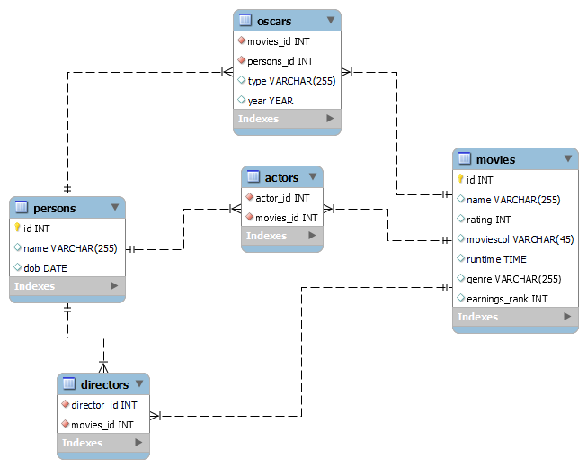
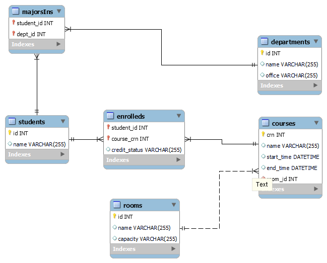

# er-diagram-sql

Assignment: 
Description: Attached 
Deliverable: Create a Repo on GitHub and upload the ER Diagram in it.   Each SQL Queries should be in a separate SQL File and uploaded to the repo as well. Commit after each SQL query or ER Diagram. Input the Repo Link on the Deliverables Sheet. 
Deadline: Sunday, Sept 11th at 11:59 PM. 

1- Convert the below DB schema to an ER Diagram and write the following SQL
query (the underlined attribute represents the PK):
Person(id, name, dob)
Movie(id, name, year, rating, runtime, genre, earnings_rank)
Actor(actor_id, movie_id)
Director(director_id, movie_id)
Oscar(movie_id, person_id, type, year)
● Find the Best-Picture winner with the best/smallest earnings rank. The
result should have the form (name, earnings_rank). Assume no two movies
have the same earnings rank.

2- Convert the below DB schema to an ER Diagram and write the following SQL
queries (the underlined attribute represents the PK):
Student(id, name)
Department(id, name, office)
Room(id, name, capacity)
Course(crn, name, start_time, end_time, room_id)
MajorsIn(student_id, dept_name)
Enrolled(student_id, course_name, credit_status)

creating movies_db

creating university_db

